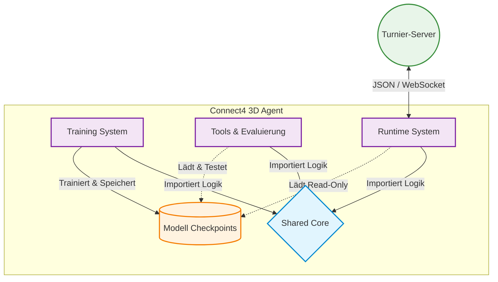

# High-Level Architektur (Ebene 1: Systemkontext & Hauptkomponenten)

Dieses Dokument bietet einen abstrakten Überblick über die Architektur des Connect4 3D Agenten (Gruppe 3). Es richtet sich an Entwickler und Dozenten, die ein grundlegendes Verständnis der Systemkomponenten und ihrer Interaktionen benötigen, ohne sich in Implementierungsdetails zu verlieren.

## 1. Systemüberblick

Der Connect4 3D Agent ist ein modulares Softwaresystem, das entwickelt wurde, um 4-Gewinnt im dreidimensionalen Raum (4x4x4) autonom zu spielen. Das System basiert auf zwei Hauptpfeilern:

1. Einer **Machine-Learning-Pipeline** zum iterativen Trainieren von neuronalen Netzen.
2. Einem **Runtime-System**, das diese trainierten Modelle nutzt, um live über ein Netzwerkprotokoll gegen andere Agenten auf einem Turnier-Server anzutreten.

Um die Komplexität zu beherrschen und Fehler zu minimieren, wurde das System in getrennte Komponenten unterteilt, die alle auf einem gemeinsamen Kern aufbauen.

## 2. Die vier zentralen Komponenten

Die Ordnerstruktur des Repositories spiegelt die logische Architektur direkt wider. Jede Komponente hat eine klar abgegrenzte Verantwortlichkeit.

### 2.1. Shared Core (`shared/`)
Das Fundament des Systems. Hier liegen ausschließlich zustandslose, mathematische Funktionen und Datenstrukturen.
* **Verantwortlichkeit:** Beinhaltet das strikte Regelwerk von 4-Gewinnt 3D, die Zug-Validierung, die Siegerkennung (Game Logic) und die Transformation des Spielfelds in Tensoren für das neuronale Netz (State Encoding).
* **Warum zentral?** Um Redundanzen und Bugs zu vermeiden, greifen alle anderen Module zwingend auf diesen Code zurück. Wenn die Spiellogik angepasst werden muss, passiert dies nur an einem einzigen Ort.

### 2.2. Training System (`training_system/`)
Der Code für das maschinelle Lernen. Dieser Bereich operiert isoliert vom Live-Betrieb.
* **Verantwortlichkeit:** Generierung von gigantischen Mengen an Trainingsdaten (via Self-Play oder durch Supervised Learning gegen Engines) und das Anpassen der Modellgewichte durch PyTorch (Backpropagation).
* **Interaktion:** Exportiert am Ende eines Trainingszyklus fertig trainierte Modelle (`.pt`-Dateien) in den internen `checkpoints/` Ordner.

### 2.3. Tools & Evaluierung (`tools/`)
Der Code für Benchmarks und Qualitätssicherung.
* **Verantwortlichkeit:** Beinhaltet gekapselte Such-Algorithmen (wie die MCTS-Engine, eine schwache Engine und die stark optimierte Alpha-Beta Minimax-Engine) sowie das Terminal-Interface (`play_terminal.py`).
* **Zweck:** Ermöglicht es den Entwicklern, neue Modell-Versionen lokal gegen klassische Algorithmen oder menschliche Spieler antreten zu lassen, um den Fortschritt statistisch messbar zu machen (Winrates), bevor ein Modell in den Live-Betrieb geht.

### 2.4. Runtime System (`runtime_system/`)
Der Spieleagent mit Schnittstelle nach außen. Dieses Modul ist ausschließlich für den echten Turnierbetrieb zuständig.
* **Verantwortlichkeit:** Verwaltung der asynchronen WebSocket-Verbindung, sauberes Parsen des Server-Protokolls (JSON) und Ausführung des geladenen Modells unter Echtzeitbedingungen.
* **Interaktion:** Das Runtime-System kennt keinerlei Trainingslogik. Es lädt lediglich ein fertiges Modell aus dem Checkpoint-Ordner ("Read-Only") und führt die Zugberechnung in Kombination mit der MCTS-Suche aus.

## 3. Datenfluss und Abhängigkeiten

Obwohl die vier Bausteine getrennt voneinander arbeiten, gibt es einen klaren Informationsfluss im Projekt:

1. **Abhängigkeit nach Unten:** `runtime_system`, `training_system` und `tools` importieren alle ihre Kernlogik aus dem `shared` Modul. Das `shared` Modul selbst importiert niemals Logik aus den anderen drei Modulen.
2. **Der Modell-Lebenszyklus:** Das `training_system` produziert und schreibt Gewichte in PyTorch-Modelle. Die `tools` und das `runtime_system` greifen lesend auf diese Modelle zu, um Entscheidungen zu treffen.

## 4. Wichtige Architekturentscheidungen

* **Isolierung der Komponenten:** Ein Fehler im Netzwerk-Parser (`runtime_system`) darf das Training (`training_system`) niemals zum Absturz bringen oder beeinflussen. Beide Systeme werden über separate Einstiegspunkte (`main_live.py` vs. `main_train.py`) gestartet.
* **Kein lokaler State im Agenten:** Das Live-System ist so konzipiert, dass es bei jedem Zug das komplette Spielfeld vom Server entgegennimmt und neu bewertet. Der Agent merkt sich keine vergangenen Brettzustände. Dies verhindert fatale Desyncs, falls Netzwerkpakete auf dem Weg zum Server verloren gehen.
* **Akzeptierte Technische Schuld:** Die strenge Kapselung führt an einigen Stellen zu leicht erhöhtem Boilerplate-Code (z. B. müssen PyTorch-Modelle in verschiedenen Modulen instanziiert und geladen werden). Dies wurde zugunsten der strikten Trennung von Live-Betrieb und isolierter Entwicklungsumgebung bewusst in Kauf genommen.
