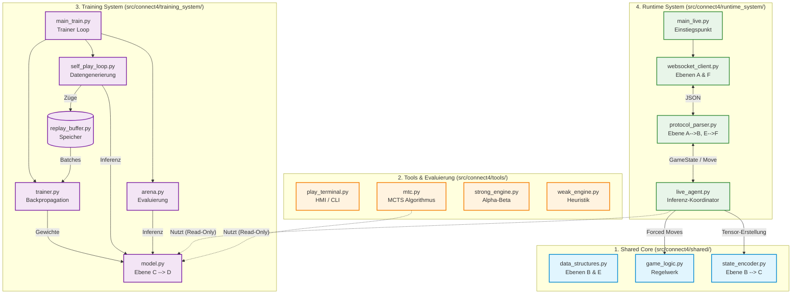

# Systemarchitektur (Ebene 2: Modul- & Dateiebene)

Dieses Dokument baut auf `level1.md` auf und bietet einen tieferen Einblick in die konkrete Implementierung der vier Hauptkomponenten des Connect4 3D Agenten. Es listet die wichtigsten Skripte pro Komponente auf und erläutert deren Kernfunktionen sowie ihre Rolle im systemweiten Datenfluss (Ebenen A bis F).

## 1. Shared Core (`src/connect4/shared/`)

Das Shared-Modul enthält die grundlegende Spiellogik und mathematische Hilfsfunktionen, auf die alle anderen Module als "Single Source of Truth" zugreifen.

* **`data_structures.py`**
    * *Funktion:* Definition der internen Spielrepräsentation (**Datenebene B** und **E**).
    * *Inhalt:* Enums für Spieler, das `GameState`-Objekt (Ebene B) inklusive `legal_mask` und das `Move`-Objekt (Ebene E).
* **`game_logic.py`**
    * *Funktion:* Die physische Regel-Engine für das 4x4x4 Brett.
    * *Inhalt:* Beinhaltet Funktionen wie `apply_move(board, move, player)` und `check_winner(board, player)`. Das Skript operiert ausschließlich auf der Datenebene B.
* **`state_encoder.py`**
    * *Funktion:* Die Brücke zwischen logischem Brett und dem neuronalen Netz.
    * *Inhalt:* Führt die Invarianz-Transformation durch und wandelt das Python-Spielfeld (**Ebene B**) in den PyTorch-Tensor für das Modell (**Ebene C**) um.

## 2. Tools & Evaluierung (`src/connect4/tools/`)

Dieses Modul beinhaltet Algorithmen und Skripte, um die Spielstärke von Agenten zu testen, Benchmarks durchzuführen oder manuell in das Spiel einzugreifen.

* **`weak_engine.py`**
    * *Funktion:* Eine sehr einfache Baseline-KI (1-Step Heuristik).
* **`strong_engine.py`**
    * *Funktion:* Ein klassischer, handgeschriebener Suchalgorithmus (Minimax mit Alpha-Beta-Pruning).
* **`mtc.py` (Monte Carlo Tree Search)**
    * *Funktion:* Der Suchbaum-Algorithmus, der das neuronale Netzwerk unterstützt.
    * *Inhalt:* Nutzt die Vorhersagen des Netzes (Ebene D), um den Suchbaum effizient in die aussichtsreichsten Richtungen zu lenken.
* **`play_terminal.py`**
    * *Funktion:* Das lokale Human-Machine-Interface (HMI).
    * *Inhalt:* Eine CLI-Schleife für Benchmarks ("Modell vs. Engine" etc.) inklusive Ausgabe von Metriken.

## 3. Training System (`src/connect4/training_system/`)

Die Pipeline zur Generierung von Modellen. Sie orchestriert das Self-Play, verwaltet die Daten und führt die Backpropagation durch.

* **`neural_network/model.py`**
    * *Funktion:* Die Architektur des KI-Gehirns.
    * *Inhalt:* Definiert die PyTorch `nn.Module` Klasse. Nimmt den Input-Tensor (**Ebene C**) auf und transformiert ihn in die rohen Policy-Logits und die Stellungsbewertung (**Datenebene D**).
* **`self_play/self_play_loop.py` & `replay_buffer.py`**
    * *Funktion:* Die Datengenerierung.
    * *Inhalt:* Lässt das Modell Partien gegen sich selbst spielen. Die Spielsituationen (Status, Masken, Wahrscheinlichkeiten) werden im `ReplayBuffer` gespeichert.
* **`training/trainer.py` & `main_train.py`**
    * *Funktion:* Die eigentliche Optimierung der Modell-Gewichte.
    * *Inhalt:* Zieht Batches aus dem Puffer, berechnet den Fehlerwert und optimiert das Modell via Backpropagation. `main_train.py` steuert die Endlosschleife.
* **`eval/arena.py`**
    * *Funktion:* Die Qualitätssicherung im Training.
    * *Inhalt:* Lässt das neu trainierte Kandidaten-Modell gegen das Champion-Modell antreten (mit reinem Argmax, ohne Exploration).

## 4. Runtime System (`src/connect4/runtime_system/`)

Das leichtgewichtige, reaktive System für den Turnierbetrieb. Es verbindet das fertige Modell mit dem Server-Protokoll.

* **`main_live.py`**
    * *Funktion:* Der Startpunkt für den Live-Agenten.
* **`network/websocket_client.py`**
    * *Funktion:* Das Kommunikationsmodul.
    * *Inhalt:* Verwaltet den Aufbau und das Aufrechterhalten der Verbindung zum Spielserver. Empfängt und sendet die rohen JSON-Envelopes (**Datenebenen A und F**).
* **`parser/protocol_parser.py`**
    * *Funktion:* Der Übersetzer zwischen Server und Agent.
    * *Inhalt:* Parst Server-Anfragen (`turn.request`) von **Ebene A nach B** und formatiert die Zugentscheidung des Agenten (`Move`) von **Ebene E nach F** (`move.submit`).
* **`agent/live_agent.py`**
    * *Funktion:* Das "Zentralnervensystem" während des Spiels.
    * *Inhalt:* Koordiniert den Datenfluss. Führt das `GameState` (Ebene B) über die Netz-Inferenz (Ebene C -> D) und wendet Hardcoded-Heuristiken (Forced Moves) an, um unter striktem Zeitlimit die finale Zugentscheidung (**Ebene E**) zu berechnen.
