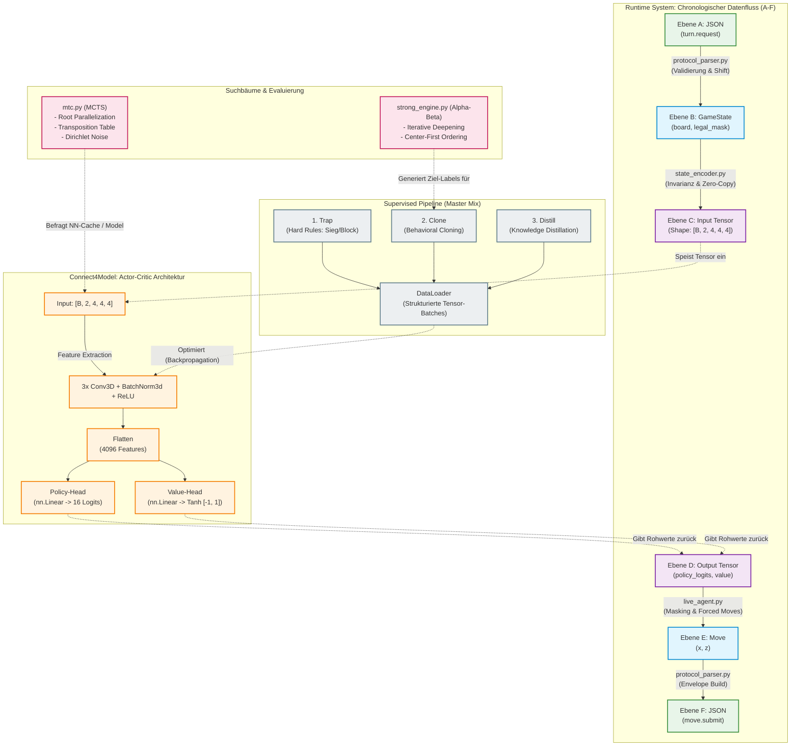

# Systemarchitektur (Ebene 3: Tiefe Implementierungsdetails & Datenfluss)

Dieses Dokument bietet einen detaillierten technischen Einblick (Deep Dive) in die Quellcode-Ebene des Connect4 3D Agenten. Es erklärt die mathematischen Transformationen, algorithmischen Optimierungen und den exakten, ebenenbasierten Datenfluss (A-F).

## 1. Shared Core: Spiellogik & Tensor-Transformation

Da diese Funktionen beim Training millionenfach aufgerufen werden, ist dieser Bereich extrem auf Performance getrimmt.

### 1.1 Matrix-Operationen und Gewinnerkennung (`game_logic.py`)
Das Spielfeld ist ein 3D-NumPy-Array der Shape `[Y, Z, X]` vom Typ `uint8`.
* **Schwerkraft-Berechnung (`Move.resolve_y`)**: Bei jedem Zug fällt der Stein in y-Richtung. Eine Schleife iteriert von `y=0` bis `y=3` und sucht den ersten Wert `0`.
* **Kurzschluss-Auswertung (`check_winner`)**: Die Erkennung ist in drei hierarchische Funktionen unterteilt, verbunden durch ein logisches `or`.
  1. `check_winner_straight_axes`: Nutzt extrem schnelle Vektoroperationen (`np.all(axis=...)`), um X-, Y- und Z-Achsen gleichzeitig zu kollabieren.
  2. `check_winner_2d_diagonals`: Schneidet den 3D-Würfel in 4x4-Scheiben und prüft 2D-Diagonalen via `np.diagonal()`.
  3. `check_winner_3d_diagonals`: Prüft mathematisch hartcodiert die 4 echten Raumdiagonalen.

### 1.2 Invarianz und Tensoren (`state_encoder.py`)
Das neuronale Netz lernt richtungsunabhängig immer aus der "Ich"-Perspektive.
* **`generate_feature_channels`**: Erstellt zwei logische Masken (Eigene Steine vs. Gegnerische Steine), wandelt sie via `.astype(np.float32)` um und stapelt sie mit `np.stack()` zu einem Array der Shape `[2, 4, 4, 4]`.
* **Speichereffizienz**: `encode_state` nutzt `torch.from_numpy()`. Dadurch teilen sich NumPy und PyTorch denselben physischen RAM-Speicher (Zero-Copy).

## 2. Runtime System: Asynchrone Echtzeit-Ausführung

Das Live-System ist auf maximale Reaktionsgeschwindigkeit und Stabilität im asynchronen Umfeld ausgelegt.

### 2.1 Entscheidungsfindung (`live_agent.py`)
Das Modell `best_champion.pt` wird einmalig bei Systemstart auf der CPU geladen (`model.eval()`).
* **Pure Forward-Pass & Heuristiken**: Der Agent verlässt sich im Live-Betrieb auf einen extrem schnellen Vorwärtspass (`torch.no_grad()`). Um blindes Vertrauen in das Modell abzufangen, führt `apply_forced_moves` einen 1-Step-Lookahead aus.
  * Gewinnt ein Zug sofort, erhält er künstlich `+2e6` Logits.
  * Blockiert ein Zug den Gegner, erhält er `+1e6` Logits.
  Dies garantiert die Ausführung kritischer Spielbeendigungen unabhängig von der Netz-Bewertung.

## 3. Tools: Hyper-Optimierte Suchbäume

Klassische Suchbäume wurden in diesem Modul hochgradig auf das 3D-Raster skaliert.

### 3.1 Multiprocessing MCTS (`mtc.py`)
Nutzt **Root Parallelization**: *N* CPU-Kerne bauen simultan *N* unabhängige Bäume auf und summieren am Ende ihre `visit_counts`.
* **Dirichlet-Rauschen**: In der Root-Node wird ein Rauschen (`np.random.dirichlet`) addiert, was die parallelen Kerne zur Exploration unterschiedlicher Äste zwingt.
* **Transposition Table (`nn_cache`)**: Bevor das rechenintensive NN befragt wird, hasht der Worker das Board (`sim_board.tobytes()`). Sieht der Baum dieselbe Stellung erneut, wird der Cache ausgelesen.
* **Terminal Caching**: Findet der Baum ein `check_winner`-Ereignis, wird dieser Knoten permanent mit `-1.0` gemarkt, sodass die Physik-Engine in Zukunft übersprungen wird.

### 3.2 Single-Core Alpha-Beta (`strong_engine.py`)
Ein "Anytime-Algorithmus". Nutzt **Iterative Deepening** (sucht Tiefe 1, dann 2, 3...), bis die `TimeOutException` greift.
* **Move Ordering**: Züge werden nach der `center_first`-Liste sortiert (innere Säulen zuerst). Alpha-Beta-Pruning schneidet so extrem früh irrelevante Äste ab.
* **Single-Core Begründung**: Im Gegensatz zu MCTS verzichtet Alpha-Beta komplett auf Multiprocessing. Der Inter-Process-Communication-Overhead (IPC) bei strengen Limits (z.B. 180ms) ist so hoch, dass ein einzelner Kern tiefer rechnen kann.

## 4. Training System: AlphaZero & Supervised Learning

Das ML-Backend besteht aus zwei getrennten Pipelines, die dieselbe Architektur bespielen.

### 4.1 Die Architektur (`model.py`)
Das Netz nutzt eine **Actor-Critic Architektur**.
* **Input:** Ein `[Batch, 2, 4, 4, 4]` Tensor.
* **Feature Extractor**: Drei 3D-Faltungsschichten (`nn.Conv3d`, Kernel 3, Padding 1) extrahieren räumliche Muster, stabilisiert durch `BatchNorm3d` und `ReLU`.
* **Dual Heads**: 
  * *Policy-Head* (`nn.Linear(4096, 16)`): Rohe Logits für die Zugwahrscheinlichkeit.
  * *Value-Head* (`nn.Linear(4096, 1) -> nn.Tanh()`): Board-Verständnis von -1.0 bis +1.0.

### 4.2 Supervised "Master Mix" Pipeline (`supervised_train.py`)
Eine dedizierte Pipeline für Offline-Training. Datengenerierung via Hierarchie:
1. **Trap (Hard Rules)**: Zwingender 100%-Zielvektor auf Sofortsieg/Block.
2. **Clone (Behavioral Cloning)**: Taktischer Lookahead der `StrongEngine`.
3. **Distill (Knowledge Distillation)**: Boltzmann-Exploration des Basismodells bei ruhigen Stellungen, um Catastrophic Forgetting zu verhindern.
Ein PyTorch `DataLoader` verarbeitet die Trajektorien anschließend automatisiert in strukturierte Tensor-Batches.

---

## 5. Chronologischer Inferenz-Datenfluss (Live-Betrieb)

Der folgende Ablauf beschreibt die strikte Transformation der Datenebenen (definiert in `data.md`) während eines aktiven Spielzugs auf dem Server.

### Phase 1: Die Ankunft ($A \rightarrow B$)
1. **Ebene A (JSON):** Das rohe JSON (`turn.request`) kommt vom Server über den WebSocket (`websocket_client.py`) an.
2. **Der Parser (`protocol_parser.py`):** Validiert das JSON und transformiert es in **Ebene B (`GameState`)**. Hier wird die `legal_mask` (Größe 16) berechnet, indem geprüft wird, welche Säulen die maximale Höhe ($y=3$) erreicht haben.

### Phase 2: Die Übersetzung für die Maschine ($B \rightarrow C$)
3. **Der Encoder (`state_encoder.py`):** Der Agent übergibt Ebene B an den Encoder. Dieser spiegelt die Steine (Invarianz-Prinzip) und liefert den `float32`-Tensor $\in \mathbb{R}^{2 \times 4 \times 4 \times 4}$ (**Ebene C**) zurück.

### Phase 3: Der Gedankengang der KI ($C \rightarrow D$)
4. **Inferenz:** Der Agent speist den Tensor (Ebene C) als Batch (`unsqueeze(0)`) in das im RAM befindliche Champion-Modell.
5. **Ebene D (Modell-Output):** Das Modell liefert **Ebene D** zurück: `policy_logits` $\in \mathbb{R}^{16}$ und den `value` $\in \mathbb{R}^{1}$. *(Hinweis: Diese Werte enthalten noch keine Kollisionslogik).*

### Phase 4: Die kluge Entscheidung ($D \rightarrow E$)
6. **Die Maskierung:** Der `live_agent.py` maskiert die `policy_logits` (Ebene D) mit der `legal_mask` (Ebene B). Illegale Züge werden mathematisch auf den negativst möglichen Wert gesetzt:
   `logits_masked = logits + (1.0 - legal_mask) * (-1e9)`
7. **Ebene E (Agent Decision):** Nach der Anwendung der Heuristiken (Forced Moves) wird mittels `argmax` der beste Index [0..15] gewählt und in logische $(x, z)$-Koordinaten konvertiert (**Ebene E**).

### Phase 5: Die Abreise ($E \rightarrow F$)
8. **Rückkanal:** Der Agent übergibt das Zug-Objekt (Ebene E) an den Parser.
9. **Ebene F (Server Format):** Der Parser bettet die Koordinaten in den vollständigen JSON-Umschlag (`move.submit`) inklusive der gespiegelten `requestId` ein (**Ebene F**).
10. **Senden:** Das Netzwerk-Modul überträgt das fertige JSON asynchron an den Server.
