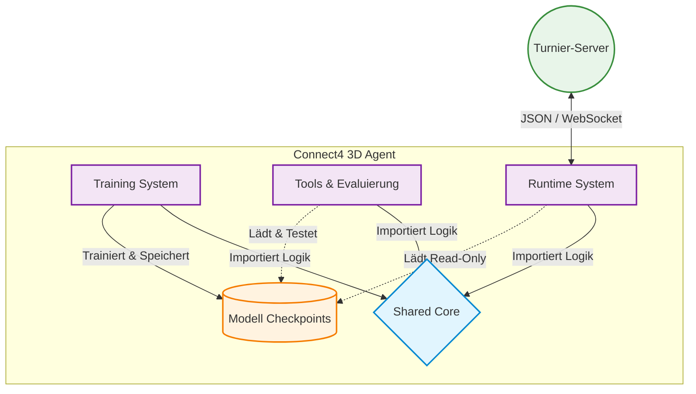

# High-Level Architektur (Ebene 1: Systemkontext & Hauptkomponenten)

Dieses Dokument gibt einen Überblick über die Architektur des Connect4 3D Agenten (Gruppe 3). Es richtet sich an Entwickler und Dozenten, die die Systemkomponenten und ihre Interaktionen nachvollziehen möchten.

## 1. Systemüberblick

Der Connect4 3D Agent ist ein modulares Softwaresystem für autonomes 4-Gewinnt im dreidimensionalen Raum (4x4x4). Das System basiert auf zwei Hauptpfeilern:

1. Einer **Machine-Learning-Pipeline** zum iterativen Trainieren von neuronalen Netzen.
2. Einem **Runtime-System**, das diese trainierten Modelle nutzt, um live über ein Netzwerkprotokoll gegen andere Agenten auf einem Turnier-Server anzutreten.

Zur Begrenzung von Komplexität und Fehlerquellen wurde das System in getrennte Komponenten unterteilt, die auf einem gemeinsamen Kern aufbauen.

## 2. Die vier zentralen Komponenten

Die Ordnerstruktur des Repositories spiegelt die Architektur wider. Jede Komponente hat eine eigene Verantwortlichkeit.

### 2.1. Shared Core (`src/connect4/shared/`)
Das Fundament des Systems. Hier liegen zustandslose Funktionen und Datenstrukturen.
* **Verantwortlichkeit:** Beinhaltet das Regelwerk von 4-Gewinnt 3D, die Zug-Validierung, die Siegerkennung (Game Logic) und die Transformation des Spielfelds in Tensoren für das neuronale Netz (State Encoding).
* **Warum zentral?** Um Redundanzen und Bugs zu vermeiden, greifen alle anderen Module auf diesen Code zurück. Regeländerungen erfolgen an einer Stelle.

### 2.2. Training System (`src/connect4/training_system/`)
Der Code für das maschinelle Lernen. Dieser Bereich operiert isoliert vom Live-Betrieb.
* **Verantwortlichkeit:** Generierung von großen Mengen an Trainingsdaten (via Self-Play oder durch Supervised Learning gegen Engines) und das Anpassen der Modellgewichte durch PyTorch (Backpropagation).
* **Interaktion:** Exportiert am Ende eines Trainingszyklus Modelle (`.pt`-Dateien) in den `checkpoints/` Ordner.

### 2.3. Tools & Evaluierung (`src/connect4/tools/`)
Der Code für Benchmarks und Qualitätssicherung.
* **Verantwortlichkeit:** Beinhaltet Such-Algorithmen (wie die MCTS-Engine, eine schwache Engine und die Alpha-Beta Minimax-Engine) sowie das Terminal-Interface (`play_terminal.py`).
* **Zweck:** Ermöglicht es den Entwicklern, neue Modell-Versionen lokal gegen klassische Algorithmen oder menschliche Spieler antreten zu lassen, um den Fortschritt statistisch messbar zu machen (Winrates), bevor ein Modell in den Live-Betrieb geht.

### 2.4. Runtime System (`src/connect4/runtime_system/`)
Der Spieleagent mit Schnittstelle nach außen. Dieses Modul ist für den Turnierbetrieb zuständig.
* **Verantwortlichkeit:** Verwaltung der asynchronen WebSocket-Verbindung, Parsen des Server-Protokolls (JSON) und Ausführung des geladenen Modells unter Echtzeitbedingungen.
* **Interaktion:** Das Runtime-System kennt keine Trainingslogik. Es lädt ein Modell aus dem Checkpoint-Ordner ("Read-Only") und führt die Zugberechnung mit der MCTS-Suche aus.

## 3. Datenfluss und Abhängigkeiten

Obwohl die vier Bausteine getrennt voneinander arbeiten, gibt es einen definierten Informationsfluss:

1. **Abhängigkeit nach Unten:** `runtime_system`, `training_system` und `tools` importieren alle ihre Kernlogik aus dem `shared` Modul. Das `shared` Modul selbst importiert niemals Logik aus den anderen drei Modulen.
2. **Der Modell-Lebenszyklus:** Das `training_system` produziert und schreibt Gewichte in PyTorch-Modelle. Die `tools` und das `runtime_system` greifen lesend auf diese Modelle zu, um Entscheidungen zu treffen.

## 4. Wichtige Architekturentscheidungen

* **Isolierung der Komponenten:** Ein Fehler im Netzwerk-Parser (`runtime_system`) darf das Training (`training_system`) niemals zum Absturz bringen oder beeinflussen. Beide Systeme werden über separate Einstiegspunkte (`main_live.py` vs. `main_train.py`) gestartet.
* **Kein lokaler State im Agenten:** Das Live-System nimmt bei jedem Zug das Spielfeld vom Server entgegen und bewertet es neu. Der Agent speichert keine vergangenen Brettzustände. Dies verhindert Desyncs, falls Netzwerkpakete verloren gehen.
* **Akzeptierte Technische Schuld:** Die Kapselung führt an einigen Stellen zu Boilerplate-Code, z. B. beim Instanziieren und Laden von PyTorch-Modellen. Dies wurde zugunsten der Trennung von Live-Betrieb und Entwicklungsumgebung akzeptiert.
